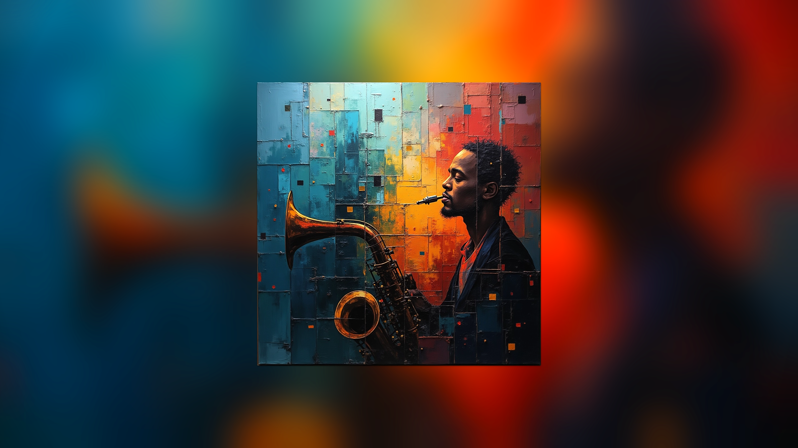
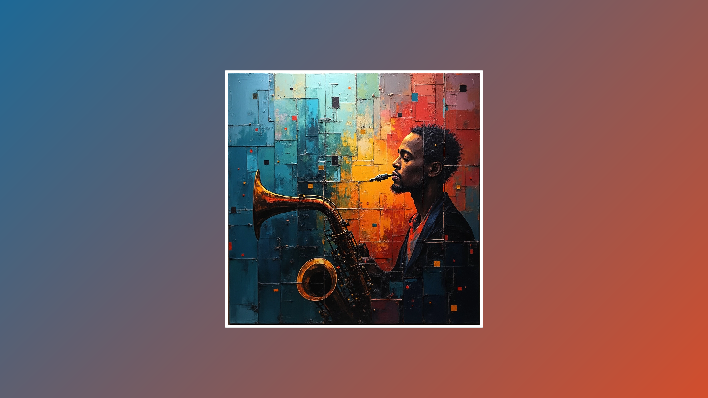
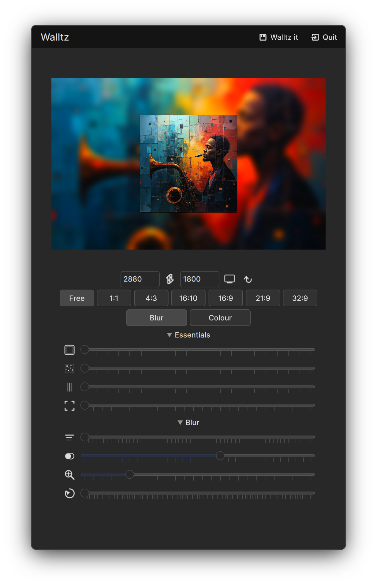
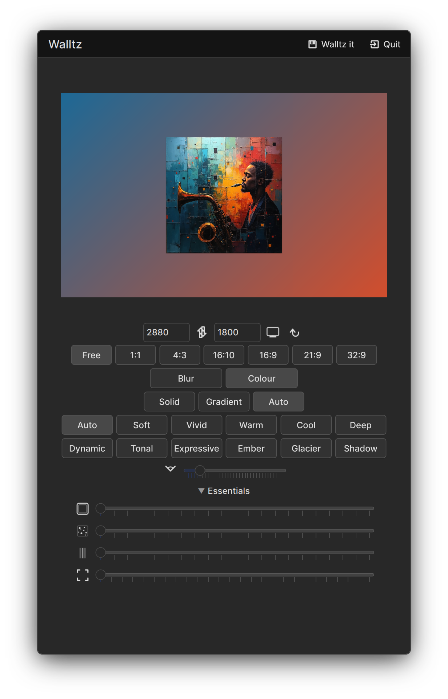

<picture>
  <source media="(prefers-color-scheme: dark)" srcset="icons/hicolor/scalable/apps/org.walltz.walltz.svg">
  
</picture>

# Walltz

> Turn any image into a cohesive desktop wallpaper — blur, auto-color extraction, gradient moods, and a suite of post-processing effects.

[](COPYING)
[](https://www.qt.io)
[](https://develop.kde.org/frameworks/kirigami/)
[-blue?logo=linux)](https://kde.org/plasma-desktop/)

---

## Overview

Walltz takes one or more images and produces a processed wallpaper:

1. **Drag a photo** — Walltz reads the image's dominant colors
2. **Choose a background** — blurred zoom of the source (like iOS/Android wallpapers), a solid color, a gradient preset, or an auto-generated gradient matched to the image
3. **Tweak effects** — vignette, film grain, chromatic aberration, photo frame, rotation, zoom
4. **Export** — saves a `.wp.png` at your target resolution (screen-native or custom)

---

## Screenshots

|| Blur + vignette | Auto-gradient + photo frame | Grain, CA, desaturation, rotation |
|---|---|---|---|
|| <a href="screenshots/scr_blur_vig.png"></a> | <a href="screenshots/scr_autograd_frame.png"></a> | <a href="screenshots/scr_grain_ca_desat_rot.png"></a> |
|| **Blur settings UI** | **Colour presets UI** | |
|| <a href="screenshots/scr_ui_blur.png"></a> | <a href="screenshots/scr_ui_colour.png"></a> | |

---

## Features

| Category | Detail |
|----------|--------|
| **Blur mode** | Adjustable Gaussian blur (sigma 1–120), saturation boost (0.0–3.0×), background rotation (0–360°) |
| **Colour mode** | Solid fill, 12 gradient presets, or auto-gradient with 6 mood palettes (V1 + V2) |
| **Mood engine** | Two extraction methods: saturation-weighted hue histogram (V1) and 3D RGB cube centroid clustering (V2) — 6 moods each |
| **Post‑processing** | Vignette (radial darkening), film grain (perlin‑style noise), chromatic aberration (radial RGB shift) |
| **Photo frame** | White rounded‑corner polaroid border with drop shadow |
| **Aspect ratios** | Free, 1:1, 4:3, 16:9, 16:10, 21:9, 32:9 |
| **Batch queue** | Drop multiple images — browse previews, process all at once |
| **Live preview** | Two‑layer crossfade, debounced 700ms regeneration on any parameter change |
| **Screen detection** | Automatic DPR‑aware resolution from the compositor (Wayland + X11) |

---

## Quick start

### Dependencies

- Qt6 (Core, Gui, Qml, Quick, QuickControls2, Concurrent, ShaderTools)
- KF6 (Kirigami, KCoreAddons, KI18n, KWindowSystem)
- Extra CMake Modules (ECM)
- C++20 compiler (GCC 13+ / Clang 16+)
- CMake ≥ 3.22

**Fedora / Bazzite:**

```bash
sudo dnf install qt6-qtbase-devel qt6-qtdeclarative-devel \
  qt6-qtquickcontrols2-devel qt6-qt5compat-devel \
  qt6-qtimageformats-devel qt6-qtshadertools-devel qt6-qtwayland \
  kf6-kirigami-devel kf6-kcoreaddons-devel kf6-ki18n-devel \
  kf6-kwindowsystem-devel kf6-extra-cmake-modules cmake gcc-c++
```

### Build & run

```bash
cmake -B build -DCMAKE_BUILD_TYPE=RelWithDebInfo
cmake --build build -j$(nproc)
./build/bin/walltz
```

### Distrobox (recommended for development)

```bash
# Enter the development container
distrobox enter walltz-dev
# Build inside the container
cd /path/to/walltz && rm -rf build && mkdir build && cd build
cmake .. && make -j$(nproc)
```

---

## Packaging

### Flatpak

```bash
flatpak-builder --user --install build-dir flatpak/org.walltz.walltz.yml
flatpak run org.walltz.walltz
```

Flatpak and AppImage artifacts are available on the [releases page](https://github.com/kirijin/walltz/releases).

### AppImage

```bash
bash scripts/build-appimage.sh
# Output: build-appimage/Walltz-<version>-x86_64.AppImage
```

---

## Project structure

```
src/
├── main.cpp                  # App entry, QML engine, Wayland screen wire-up
├── WallpaperProcessor.h      # QObject CPP class — all rendering, effects, queue
├── WallpaperProcessor.cpp    # ~1500 lines: blur, gradients, moods, post‑fx
├── Main.qml                  # Full Kirigami UI: drop zone, controls, preview
├── CollapsibleSection.qml    # Animated accordion container
├── ThemedIcon.qml            # SVG icon tinted via MultiEffect.colorization
└── icons/                    # 12 flat‑style tool SVGs
```

---

## Changelog

### 0.1.0 (2026-07-19)

- Drop single or multiple images
- Blur and colour background modes
- Auto colour extraction from image
- Manual color picker with palette swatches
- 12 gradient presets with angle control
- 6 mood palettes (V1 + V2 extraction)
- Vignette, grain, chromatic aberration effects
- Photo frame with shadow
- Batch processing with progress
- Live preview with crossfade
- Wayland fractional‑DPR screen detection
- Flatpak and AppImage packaging

---

## Acknowledgments

Walltz stands on the shoulders of two projects that pioneered the "blurred-background wallpaper" concept:

- **[Wallpaperize](https://github.com/Philip-Scott/wallpaperize)** by Felipe Escoto — the elementaryOS app that brought this workflow to Linux desktops. Walltz's mood engine and gradient system were directly inspired by Wallpaperize's design.
- **[Backgroundifier](https://github.com/archagon/backgroundifier-public)** by Alexei Baboulevitch (Archagon) — the original macOS app (2015) that first turned oddly-sized images into beautiful desktop wallpapers. The core idea — zoomed blur behind the source image — originates here.

## License

GNU General Public License v3.0 or later. See [COPYING](COPYING).
